# WEB STACK IMPLEMENTATION (LAMP STACK) IN AWS

## Introduction:

The LAMP stack is a popular open-source web development platform that consist of four main components: Linux, Apache, MySQL and PHP (Perl or Python). This documentation outlines the setup, configuration, and usage of the LAMP stack.

### Step 0 - Preparing prerequisites

**1- Created an EC2 instance of t3.micro type which happens to be a free tier and Ubuntu 24.04 LTS (HVM) and was launched in us-east1 AWS region.**

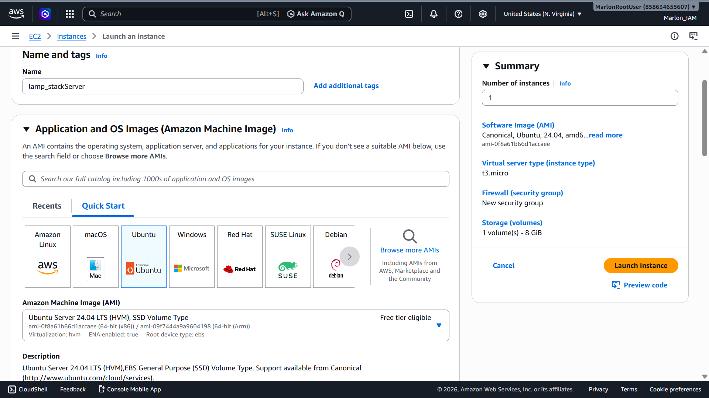

**2- Created SSh key pair named lamp-ec2-key to access instance on port 22**

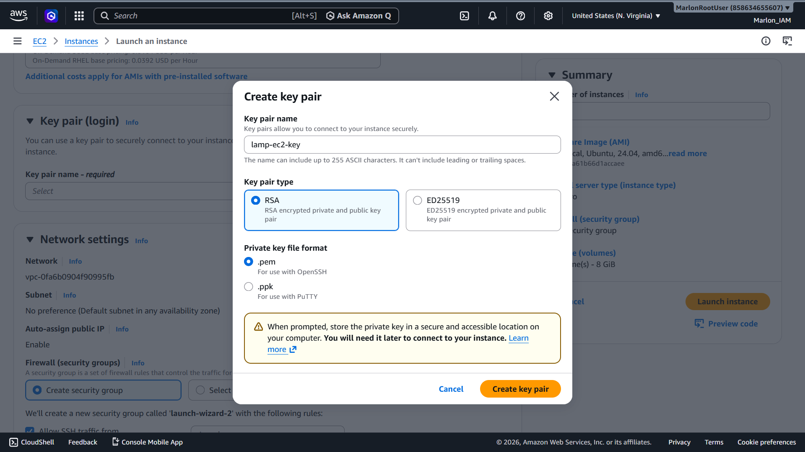

**3- The following security grops were congigured:**

- Allow traffic on port 80 (HTTP) with source from anywhere on the internet
- Allow traffic on port 443 (HTTPS) with source from anywhere on the internet
- Allow traffic on port 22 (SSH) with source from any IP address. This is opened by default.  
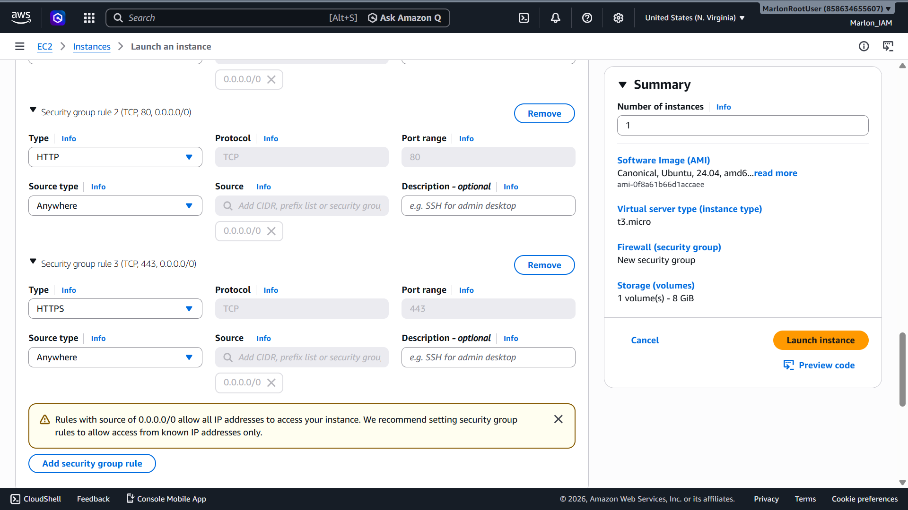

**4- The default VPC and subnet was used for network configurations**

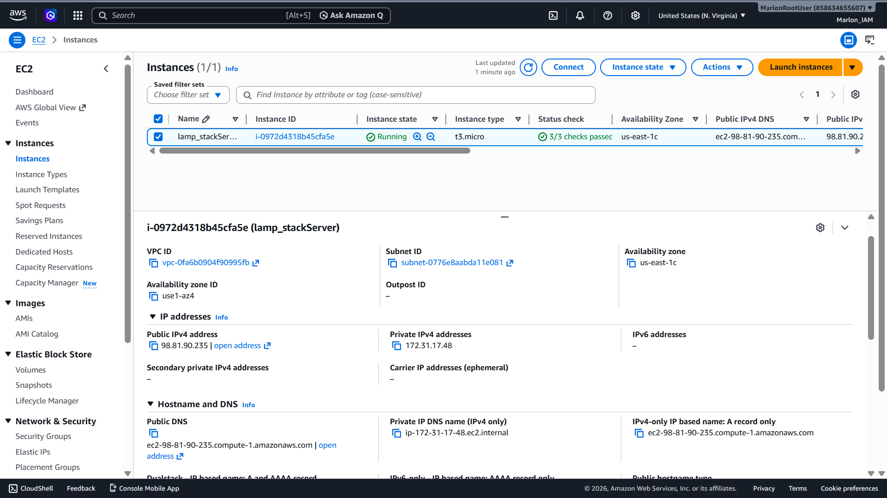

**5- The SSH protocol was used to establish connectivity to the EC2 instance by using the following command on**

```bash
ssh -i lamp-ec2-key.pem ubuntu@54.234.122.249
```

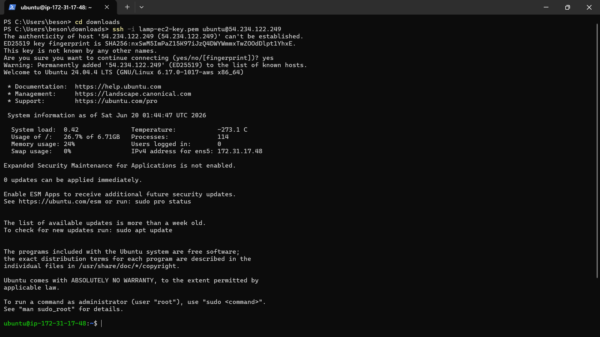

### Step 1 - Installing Apache and Update the firewall

**1- Updating and upgrading list of packages in package manager**

```bash
sudo apt update
sudo apt upgrade -y
```

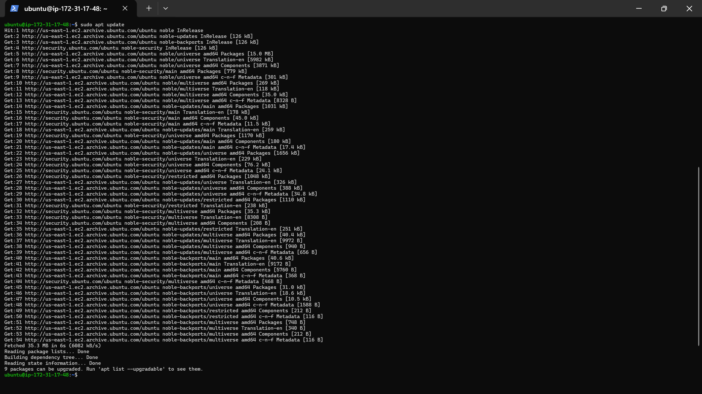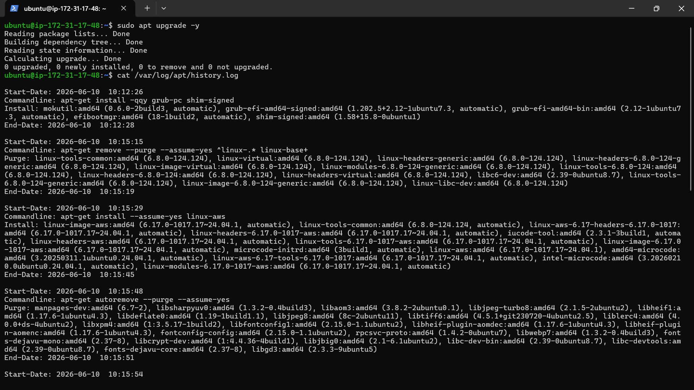

**2- Run apache2 package**

```bash
sudo apt install apache -y
```

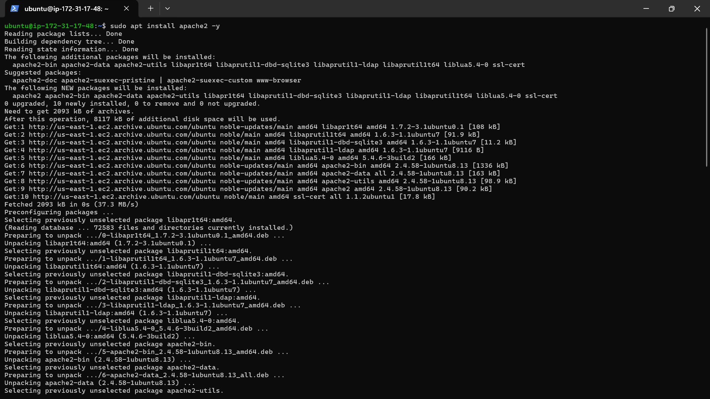

**3- Enable and verify that apache is running as a service on the OS**

```bash
sudo systemctl enable apache2
sudo systemctl status apache2
```

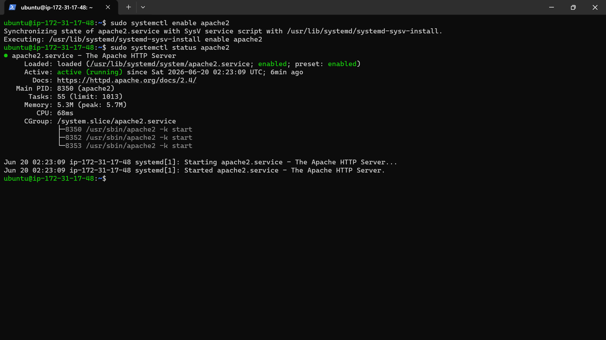

**4- The server is running and can be accessed locally in the ubuntu shell by running the command below:**

```bash
curl http://localhost:80

OR

curl http://127.0.0.1:80
```

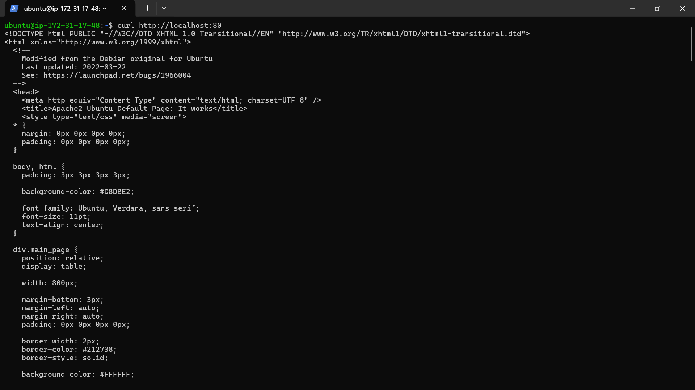

**5- Test with the public IP address if the Apache HTTP server can respond to request from the internet using the url on a browser**

```bash
http://54.234.122.249:80
```

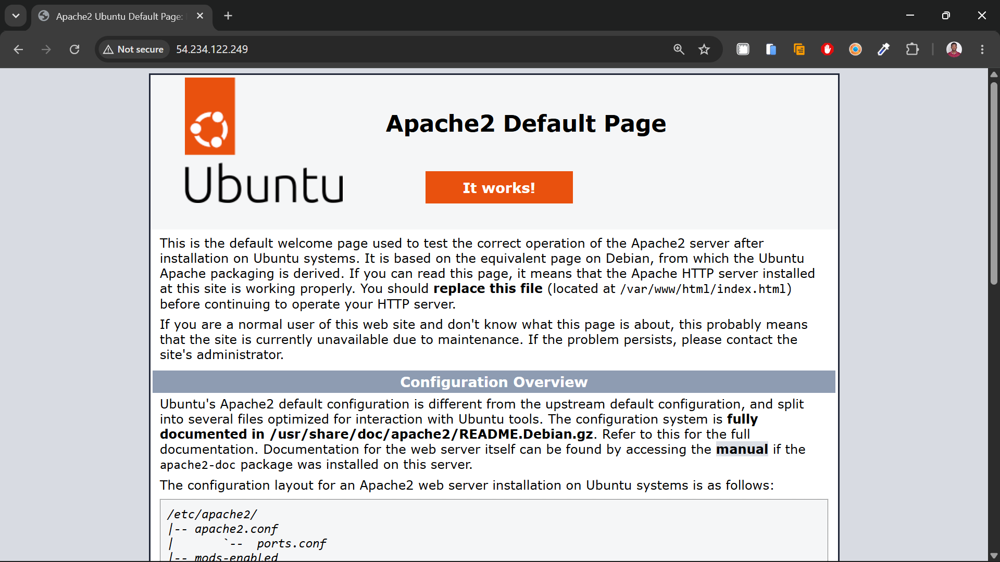

This shows that the web server is corectly installed and it is accessible through the firewall.

### ++Step 2 - Installing MySQL++

**1- Install a relational database (RDB)**

MySQL was installed in this project. it is a popular relational database management system used whithin PHP environment and other frameworks.

```bash
sudo apt installl mysql-server
```

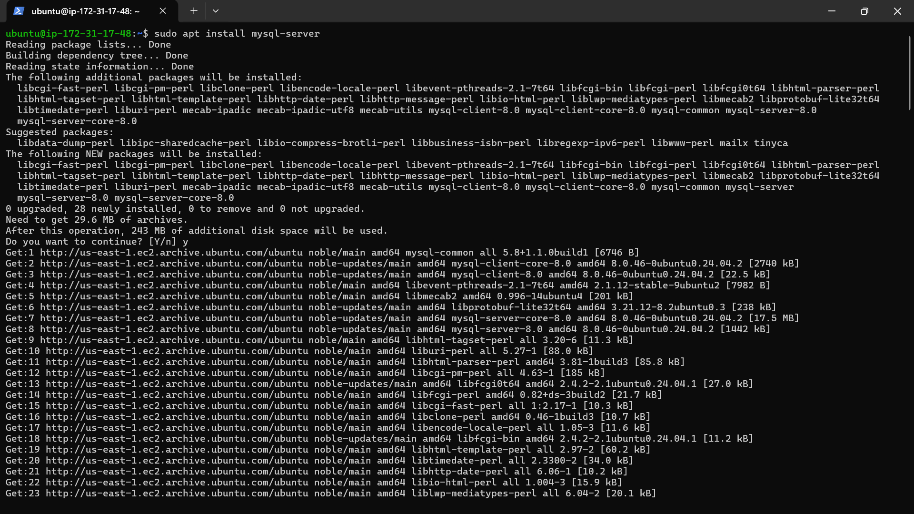When prompted, installation was confirmed by typing Y and ENTER.

**2- Enable and verify that mysql is running with the commands below**

```bash
sudo systemctl enable --now mysql
sudo systemctl status mysql
```

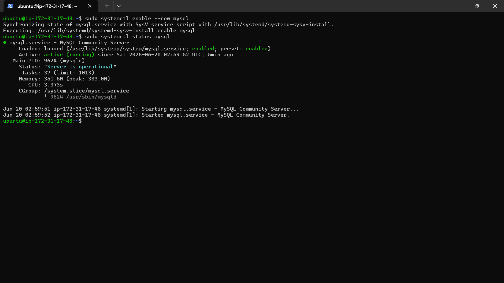

**3- Log into mysql console**

```bash
sudo mysql
```

This connects the MySQL server as the administrative database user root infered by the usef sudo when running the command.

**4- Set a password for root user mysql_native_password as a default authentication method her, the user's password was defined as "Password.1"**

```bash
ALTER USER 'root'@'localhost' IDENTIFIED WITH mysql_native_password BY 'PassWord.1';
```

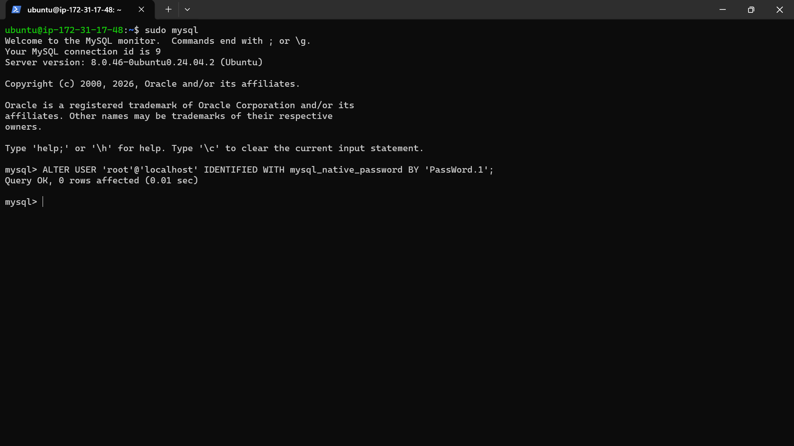Exit the MySQL shell

```bash
exit
```

**5- Run an interactive scrip to secure MySQL**

The security script comes pre-installed with mysql. This script removes some insecure settings and lock down access to the database system

```bash
sudo mysql_secure_installation
```

ggc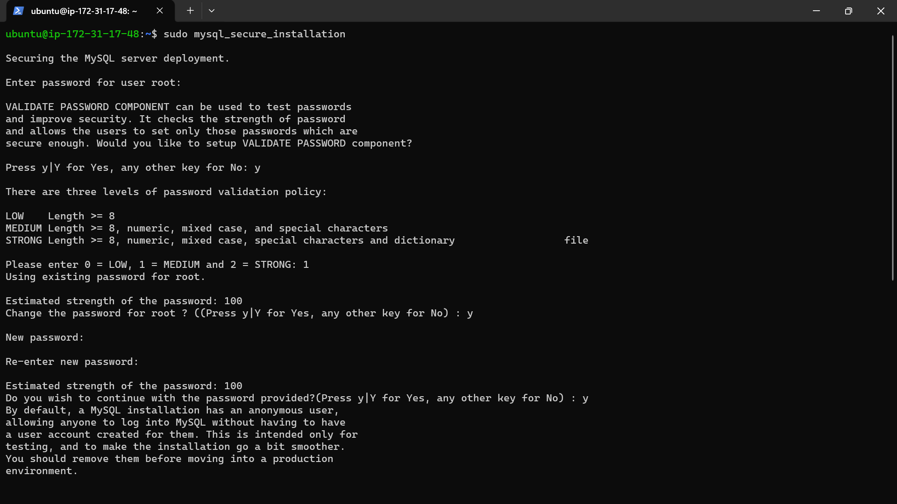

Regardless of whether you chose to set up the `VALIDATE PASSWORD PLUGIN`, your server will next ask you to select and confirm a password for the MySQL **root** user.

**6- After changing root user password, loginto MySQL console.**

A command prompt for password was noticed after running the command below.

```bash
sudo mysql -p
```

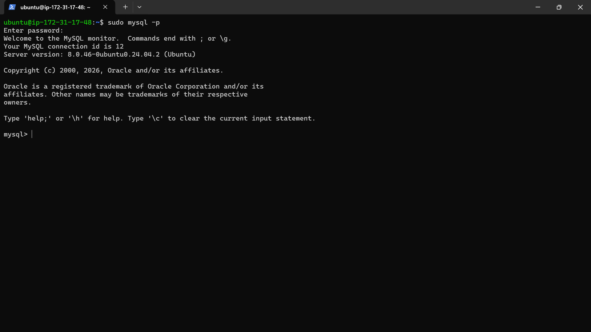Exit MySQL shell

```bash
exit
```

### ++Step 3 - Installing PHP++

**1- **You have Apache installed to serve your content and MySQL installed to store and manage your data. PHP is the component of our setup that will process code to display dynamic content to the end user.

The following were installed:

- Php package
- php-mysql, a php module that allows PHP to communicate with MySQL-based databases
- libapache2-mod-php, to anable Apache to handle PHP file.

```bash
sudo apt install php libapache2-mod-php php-mysql
```

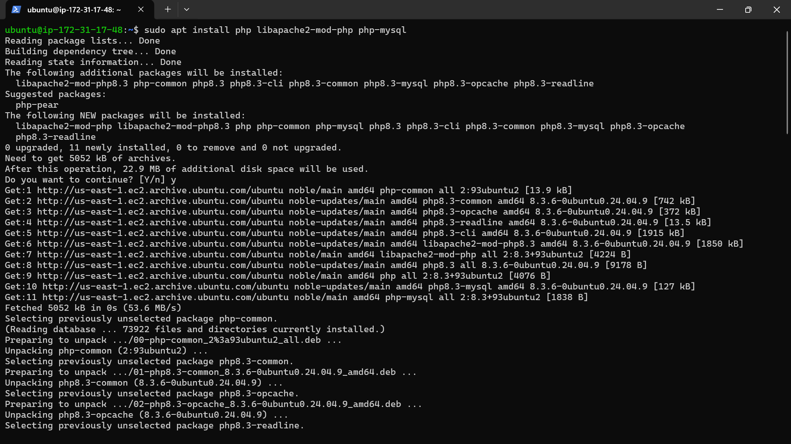

The following command to confirm PHp version

```bash
php -v
```

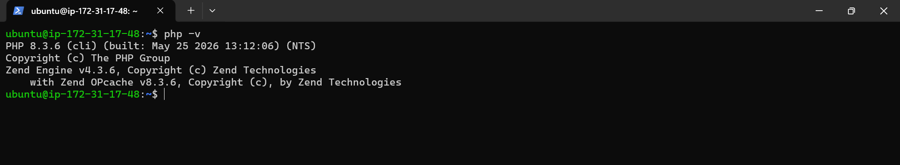

At this point, your LAMP stack is completely installed and fully operational.

To test your setup with a PHP script, it’s best to set up a proper Apache Vitual Host to hold your website’s files and folders. Virtual host allows you to have multiple websites located on a single machine and users of the websites will not even notice it.

### ++Step4 - Create a virtual host for the website using Apache++

**1-  The default directory serving the apache default page is /var/www/html. Create your doucment directory next to the default one.**

Create the directory for projectlamp using "mkdir" command

```bash
sudo mkdir /var/www/projectlamp
```

Assign the directory ownership with $USER environment variable which references the current system user.

```bash
sudo chown -R $USER:$USER /var/www/projectlamp
```

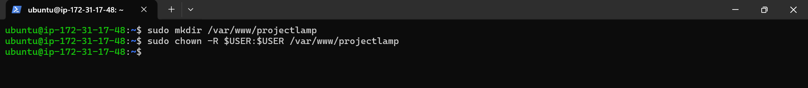

**2- Create and open a new configuration file in apache's "sites-available" directory using vim.**

```bash
sudo vim /etc/apache2/sites-available/projectlamp.conf
```

Past the bare-bones configuration below:

```bash
<VirtualHost *:80>
  ServerName projectlamp
  ServerAlias www.projectlamp
  ServerAdmin webmaster@localhost
  DocumentRoot /var/www/projectlamp
  ErrorLog ${APACHE_LOG_DIR}/error.log
  CustomLog ${APACHE_LOG_DIR}/access.log combined
</VirtualHost>
```

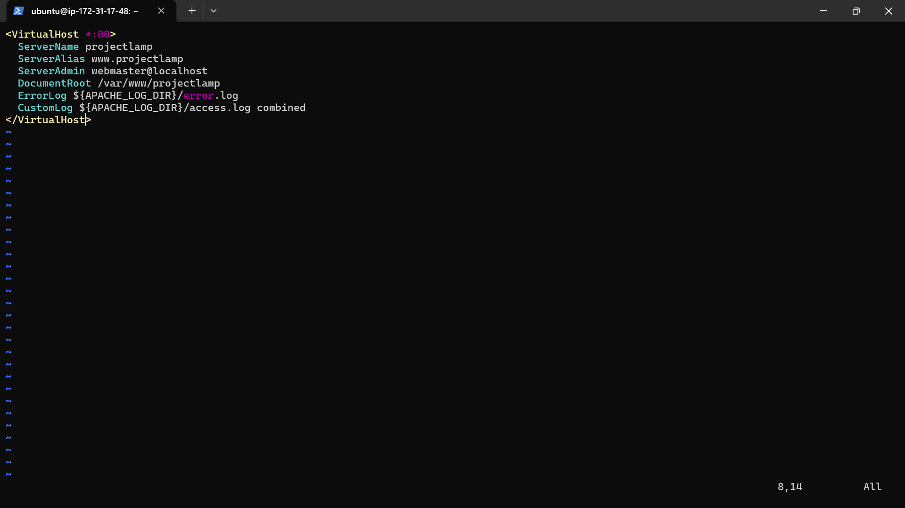

3- Show the new file sites-available

```bash
sudo ls /etc/apache2/sites-available
```

```bash
Output:
000-default.conf default-ssl.conf projectlamp.conf
```

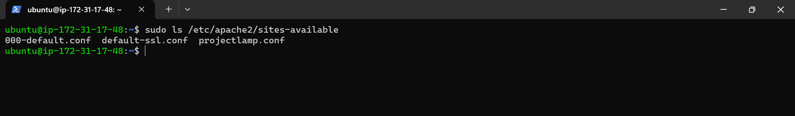

With the VirtualHost configuration, Apache will serve projectlamp using /var/www/projectlamp as its web root directory.

**4- Enable the new virtual host**

```bash
sudo a2ensite projectlamp
```

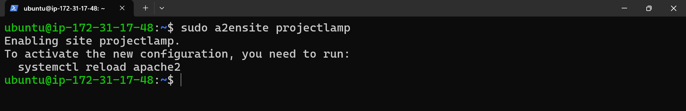

**5- Disable Apache's default website.**

This is because Apache’s default configuration will overwrite the virtual host if not disabled. This is required if a custom domain is not being used.

```bash
sudo a2dissite 000-default
```

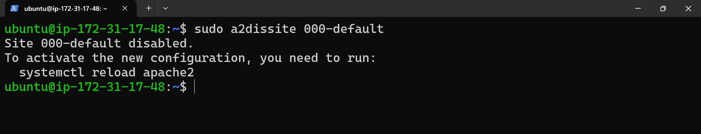

**6- Ensure the configuration does not contain syntax error**

The command below was used:

```bash
sudo apache2ctl configtest
```

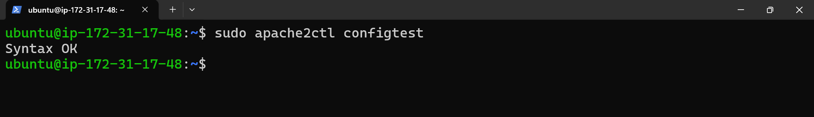

**7- Reaload apache for changes to take effect**

```bash
sudo systemctl reload apache2
```

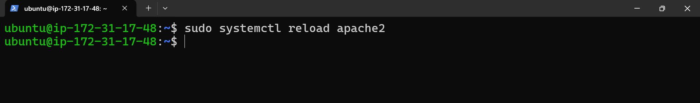

**8- new website is now active, but the web root /var/www/projectlamp is still empty. Create an index.html file in that location so that we can test that the virtual host works as expected:**

```bash
sudo echo 'Hello LAMP from hostname' $(TOKEN=`curl -X PUT "http://169.254.169.254/latest/api/token" -H "X-aws-ec2-metadata-token-ttl-seconds: 21600"` && curl -H "X-aws-ec2-metadata-token: $TOKEN" -s http://169.254.169.254/latest/meta-data/public-hostname) 'with public IP' $(TOKEN=`curl -X PUT "http://169.254.169.254/latest/api/token" -H "X-aws-ec2-metadata-token-ttl-seconds: 21600"` && curl -H "X-aws-ec2-metadata-token: $TOKEN" -s http://169.254.169.254/latest/meta-data/public-ipv4) > /var/www/projectlamp/index.html
```

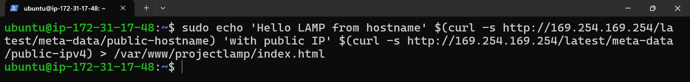

**9- Open the website on a browser using the public IPddress.**

```bash
http://107.23.19.175:80
```

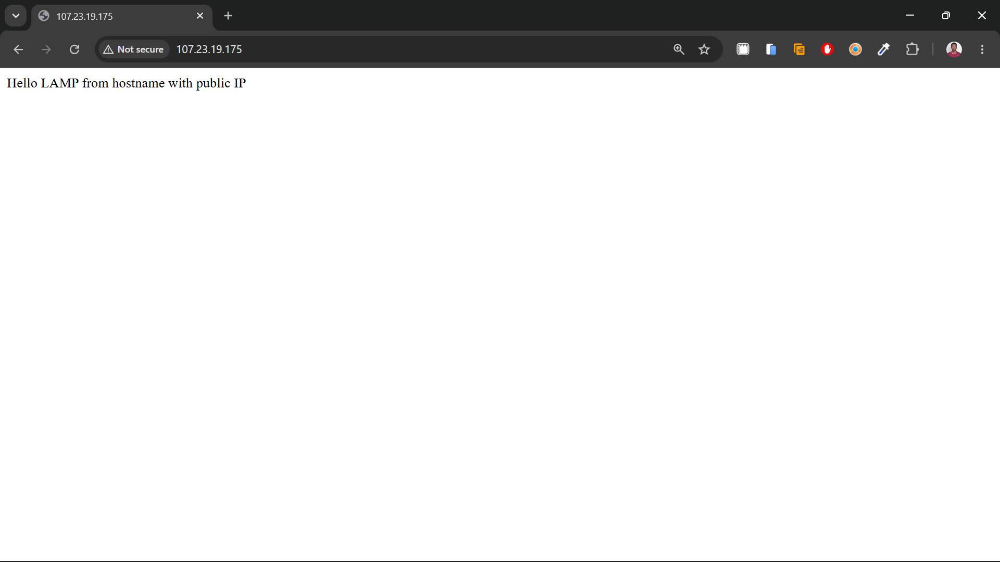

**10- Open the wesite with the public dns name (port is optional)**

```bash
http://<public-DNS-name>:80
```

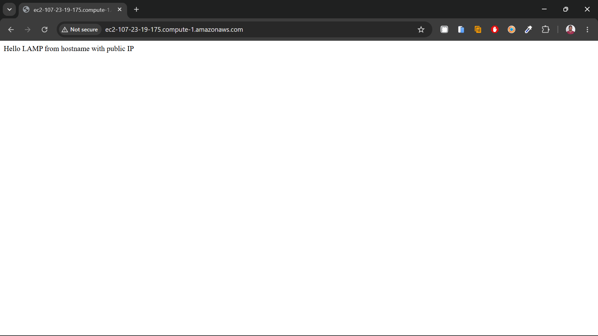

This file can be left in place as a temporary landing page for the application until an index.php file is set up to replace it. Once this is done, the index.html file should be renamed or removed from the document root as it will take precedence over index.php file by default.

### ++Step 5 - Enabling PHP on the wesite++

With the default **DirectoryIndex** settings on Apache, a file named index.html will always take precedence over an index.php file. This is useful for setting up maintenance pages in PHP applications, by creating a temporary index.html file containing an informative message to visitors. Because this page will take precedence over the index.php page, it will then become the landing page for the application. Once maintenance is over, the index.html is renamed or removed from the document root, bringing back the regular application page.

**1- Open the dir.conf filw with vim to change the bahaviour**

```bash
sudo vim /etc/apache2/mods-enabled/dir.conf
```

```bash
<IfModule mod_dir.c>
        #Change this:
        #DirectoryIndex index.html index.cgi index.pl index.php index.xhtml index.htm
        #To this:
        DirectoryIndex index.php index.html index.cgi index.pl index.xhtml index.htm
</IfModule>
```

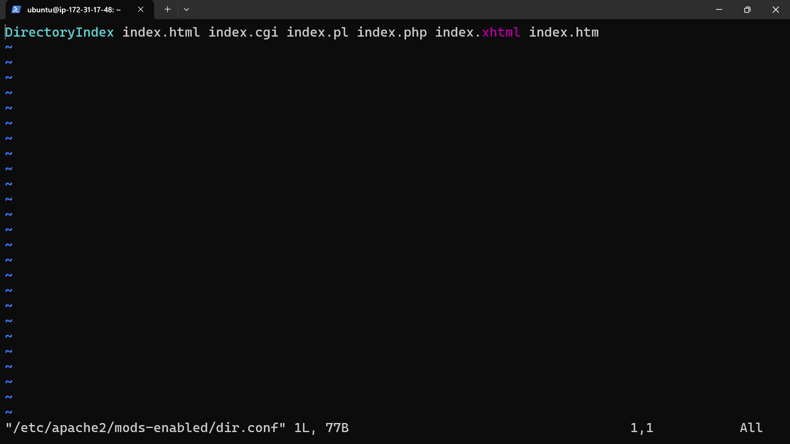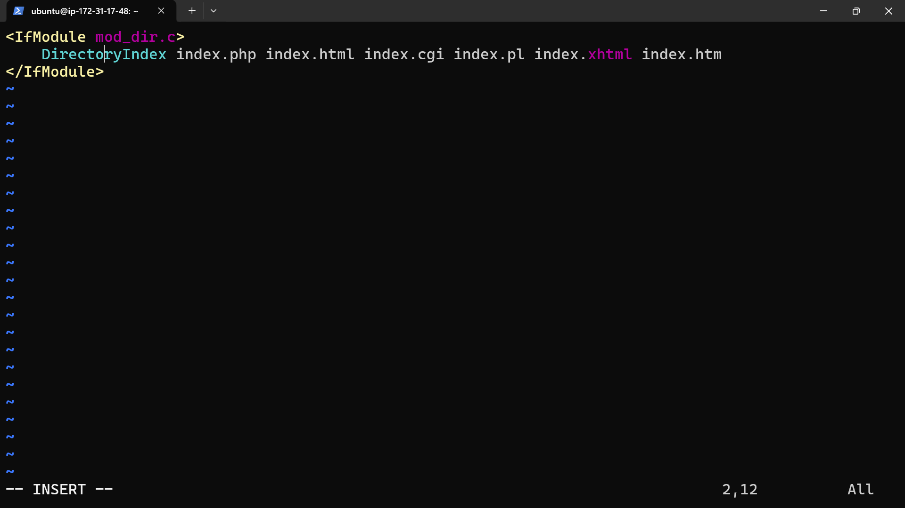

**2- Reload Apache**

After saving and closing the file, you will need to reload Apache so the changes take effect:

```bash
sudo systemctl reload apache2
```

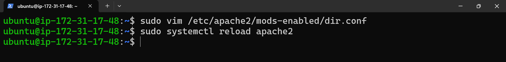

**3- Create a php test script to confirm that Apache is able to handle and process requests for PHP files.**

A new index.php file was created inside the customb root folder.

```bash
vim /var/www/projectlamp/index.php
```

Add the text below in the index.php file

```bash
<?php
phpinfo();
```

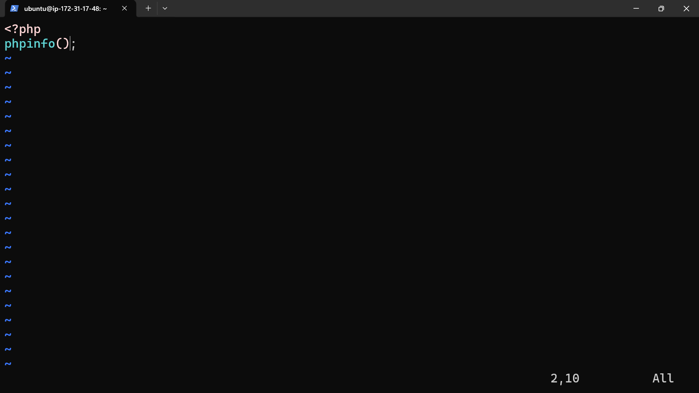

**4- Now refresh the public IP page**

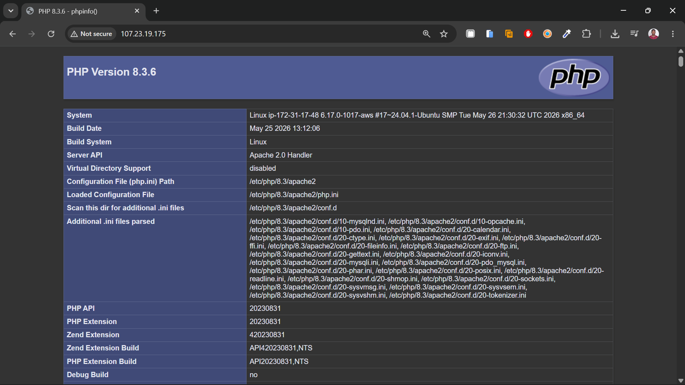

This page provides information about your server from the perspective of PHP. It is useful for debugging and to ensure that your settings are being applied correctly.

If you can see this page in your browser, then your PHP installation is working as expected.

After checking the relevant information about your PHP server through that page, it’s best to remove the file you created as it contains sensitive information about your PHP environment -and your Ubuntu server. You can use rm to do so:

```bash
sudo rm /var/www/projectlamp/index.php
```

### Conclusion:

The LAMP stack provides a robust and flexible platform for developing and deploying web applications. By following the guidelines outlined in this documentation, It was possible to set up, configure, and maintain a LAMP environment effectively, enabling the creation of powerful and scalable web solutions.
